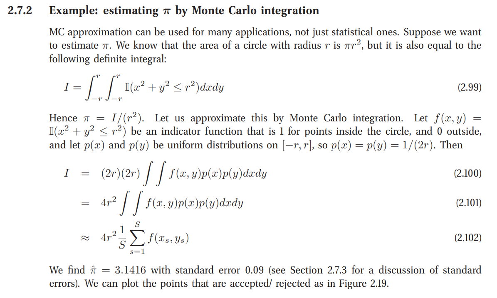

# monte-carlo-pi

This is the implementation to an interesting method of estimating pi based on Monte Carlo integration mentioned in:
```
@book{murphy2012machine,
  title={Machine learning: a probabilistic perspective},
  author={Murphy, Kevin P},
  year={2012},
  publisher={MIT press}
}
```

The idea is described in the figure below:<br>

